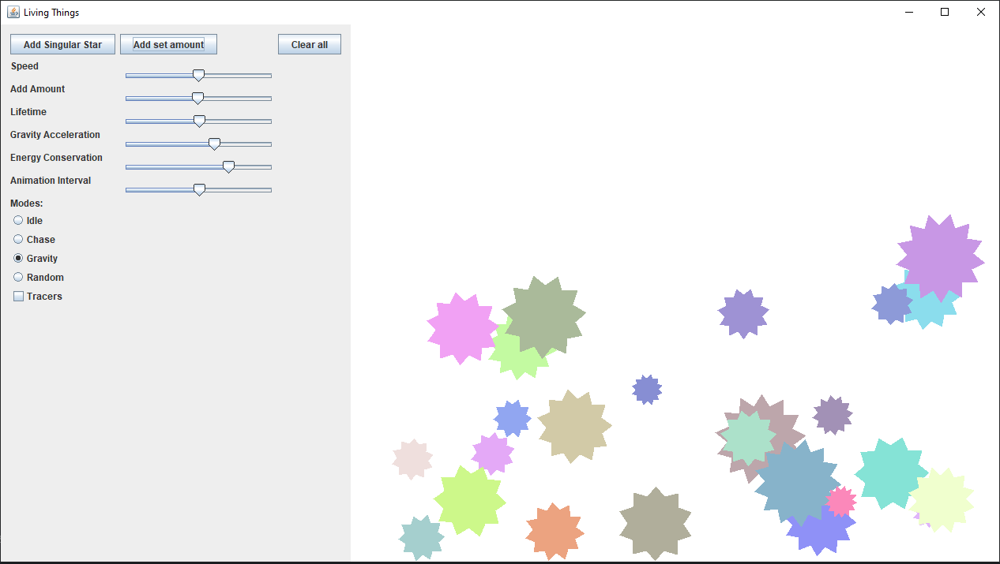

# Moving-Shapes
This program consists of a user interface as well as a screen showing the moving shapes.  
The user can control several options from speed of the shapes, to conservation of energy.

### Learning Outcomes:
✔️ Learned how to implement and use the Runnable interface  
✔️ Learned how to handle multiple concurrent clients connected to one server  
✔️ Learned how to draw and manipulate 2D graphics

</img>

